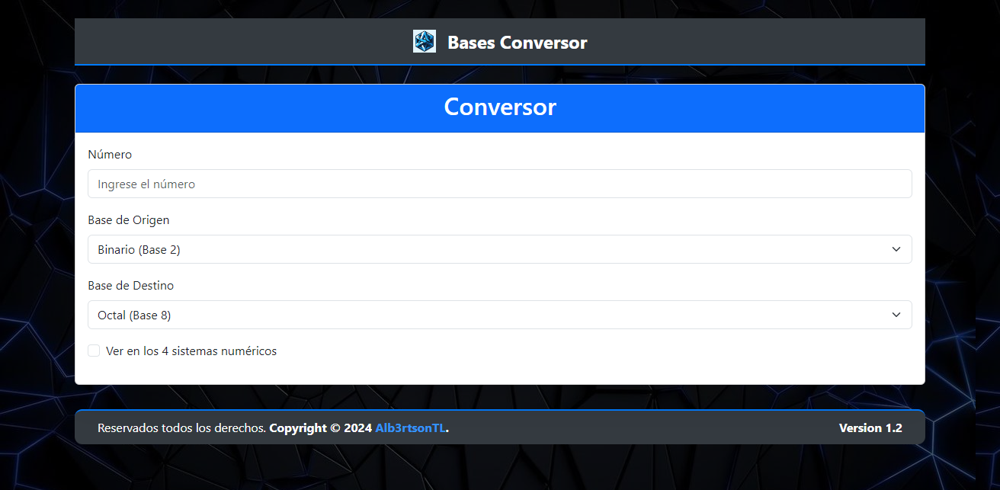

<br>

# Bases Conversor [](https://basesconversor.rf.gd)

 
[](https://opensource.org/licenses/MIT)
[](https://github.com/Alb3rtsonTL/conversorSN)


## Tabla de Contenidos 📑
1. [Descripción de la Aplicación](#descripción-📑)
2. [Tecnologías Utilizadas](#tecnologías-utilizadas-🛠)
3. [Características de la Aplicación](#características-🎯)
4. [Conocimientos Requeridos](#conocimientos-requeridos🙇🏻)
5. [Uso de la Aplicación](#uso-🧩)
6. [Instalación](#instalación-📦)
7. [Estructura del Proyecto](#estructura-del-proyecto-⚙)
8. [Créditos](#créditos-👨‍💼)
9. [Licencia](#licencia-📖)


## Descripción 📑

La Aplicación de Conversor de Bases es una herramienta interactiva desarrollada para convertir números entre distintos sistemas numéricos: Binario (Base 2), Octal (Base 8), Decimal (Base 10) y Hexadecimal (Base 16). Esta aplicación permite realizar las conversiones de manera fácil y rápida gracias a su interfaz intuitiva. Además, ofrece la posibilidad de visualizar el resultado en todas las bases simultáneamente.

El sistema está implementado con PHP, HTML5, CSS3 y JavaScript, con un diseño moderno y responsivo utilizando Bootstrap 5.


## Tecnologías Utilizadas 🛠

Para desarrollar esta aplicación se requieren conocimientos en las siguientes tecnologías:

<!-- Iconos sacados de: https://github.com/hendrasob/badges/blob/master/README.md , https://github.com/Ileriayo/markdown-badges , https://ileriayo.github.io/markdown-badges/ y https://github.com/alexandresanlim/Badges4-README.md-Profile -->

[](https://es.wikipedia.org/wiki/HTML5)
[](https://es.wikipedia.org/wiki/CSS)
[](https://es.wikipedia.org/wiki/JavaScript)
[](https://es.wikipedia.org/wiki/PHP)
[](https://getbootstrap.com)

### Frontend (HTML, CSS):
- Utilizado para estructurar el contenido de la página.
- Aplicación de estilos y diseño responsivo mediante Bootstrap y estilos personalizados.
- Uso de lógica en el frontend para realizar conversiones en tiempo real y manipular el DOM.

### Backend (JS, PHP):
- Manejo de configuraciones dinámicas y renderizado de información en el servidor.

### Librería (Bootstrap):
- Utilizado para crear un diseño responsivo y moderno.


## Características 🎯

1. Conversión entre bases numéricas: Soporte para Binario (Base 2), Octal (Base 8), Decimal (Base 10) y Hexadecimal (Base 16).

2. Conversión simultánea: Opcionalmente, puedes ver el número convertido en todas las bases simultáneamente.

3. Validación automática: El sistema valida que el número ingresado sea válido en la base seleccionada.

4. Resultados inmediatos: La conversión se realiza en tiempo real mientras se ingresa el número.

5. Interfaz moderna y responsiva: Diseño limpio y adaptable a dispositivos móviles y de escritorio gracias a Bootstrap.

6. Información dinámica: Uso de PHP para gestionar metadatos como nombre, versión y derechos de autor.


## Conocimientos Requeridos🙇🏻
Para entender y desarrollar esta aplicación, es necesario tener conocimientos básicos e intermedios en:

1. HTML5: Estructuración de contenido y uso de formularios.

2. CSS3: Estilos básicos y avanzados; manejo de Bootstrap para diseños responsivos.

3. JavaScript: Manipulación del DOM, lógica de conversión y validación en el cliente.

4. PHP: Manejo de configuraciones y renderizado de información en el servidor.

5. Lógica de Sistemas Numéricos: Comprensión de cómo funcionan las bases numéricas.


## Uso 🧩 


Este proyecto esta sujeto a una [licencia de uso](#licencia--licenceLicencia).

Sigue estos pasos para utilizar la aplicación:

1. **Inicia la Aplicación:**\
   Accede a la página principal desde tu servidor local o en el navegador:

   ```
   http://localhost/conversorSN/
   ```

2. **Ingresa el Número:**\
   Escribe el número que deseas convertir en el campo **"Número"**.

3. **Selecciona la Base de Origen:**\
   Elige la base numérica original del número (Binario, Octal, Decimal o Hexadecimal).

4. **Selecciona la Base de Destino:**\
   Elige la base a la que deseas convertir el número.

5. **Conversión Automática:**\
   Los resultados se mostrarán automáticamente en el panel de **Resultados**.

6. **Ver en Todas las Bases (Opcional):**\
   Marca la casilla **"Ver en los 4 sistemas numéricos"** para ver el número convertido en todas las bases simultáneamente.


## Instalación 📦

1. **Clona el Repositorio:**

   ```bash
   git clone https://github.com/Alb3rtsonTL/conversorSN.git
   cd conversorSN
   ```
 
2. **Coloca los Archivos en el Servidor Local:**\
   Asegúrate de tener un servidor local como XAMPP, WAMP o Laragon. Copia los archivos en la carpeta **htdocs** o equivalente.

3. **Abre la Aplicación:**\
   Dirígete al navegador y accede a:

   ```
   http://localhost/conversorSN/
   ```


## Estructura del Proyecto ⚙

```plaintext
conversorSN/
|
├── Screenshots             # Capturas de pantalla
├── fondo-WhatIf.jpeg       # Imagen de fondo
├── index.php               # (lógica de la aplicación)
├── License.md              # Documentación
├── Logo.png                # Logo de la aplicación
├── ReadMe.md               # Documentación
├── style.css               # Estilos personalizados
```


## Créditos 👨‍💼

- **Autor:** [Alb3rtsonTL](https://github.com/Alb3rtsonTL)
- **Versión:** 1.2
- **Repositorio:** [GitHub](https://github.com/Alb3rtsonTL/conversorSN)


## Licencia 📖

Este proyecto está licenciado bajo la *[Licencia AGPL](./Licence.md)*. Puedes usar, modificar y distribuir este código de manera libre y abierta.

Use bajo los términos de la licencia.
